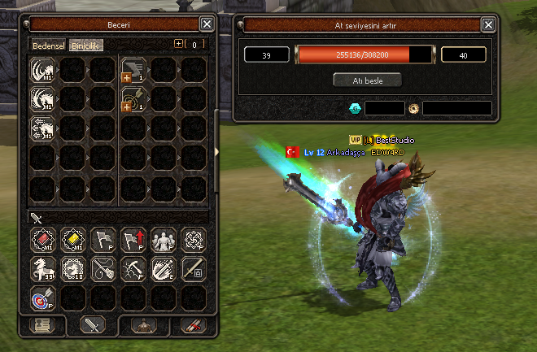

# Mount Upgrade System / Resmi At Geliştirme Sistemi



Tanıtım videosu:  
https://youtu.be/Gt7w3lSJHJU

Bu paket, Metin2 için hazırlanmış **Resmi At Geliştirme Sistemi** exportudur. Sistem `__MOUNT_UPGRADE__` ve `ENABLE_MOUNT_UPGRADE_SYSTEM` flagleri ile çalışır; at seviyesi, at geliştirme deneyimi, yem tüketimi, başarısız yükseltme durumu, pasif binicilik yetenekleri, client UI, packet akışı, DB kayıtları ve quest bağlantılarını birlikte ele alır.

Paket iki kullanım şekli düşünülerek hazırlandı:

- `01. Svn`, `02. Client`, `03. Server`: Sistemi manuel entegre etmek isteyenler için dosya dosya ekleme/değiştirme notları ve gerekli parçalar.
- `Added`: Sistemin hazır eklenmiş hali. İnsanlar sistemi eklerken zorlanmasın diye, ilgili dosyaların entegre edilmiş örnekleri burada tutulur.

## Sistem Özeti

At Geliştirme Sistemi, klasik at sistemini genişletir ve oyuncuya şu akışları sağlar:

- At seviyesini resmi sistem mantığına uygun şekilde geliştirme.
- `50048` At Yemi ile at geliştirme deneyimi kazandırma.
- Başarılı/başarısız seviye yükseltme sonucunu DB üzerinde saklama.
- `285-311` arası pasif binicilik yeteneklerini öğrenme ve geliştirme.
- At üzerinde aktif olan pasif bonusları affect sistemiyle oyuncuya uygulama.
- Client tarafında özel At Geliştirme penceresi, tooltipler, ikonlar ve skill görselleri ile tam UI desteği.

Sistemde server otoriterdir. Client yalnızca pencereyi açar ve istek gönderir; yem, Yang, Gaya, skill seviyesi, at seviyesi, item ve güvenlik kontrolleri server tarafında yapılır.

## Klasör Yapısı

```text
Mount Upgrade System/
  official-horse-system.png
  README.md
  01. Svn/
    Client/
    Server/
    Tools/
  02. Client/
    root/
    uiscript/
    locale/
    icon/
    d_/
  03. Server/
    mysql/
    proto/
    share/
  Added/
    01. Svn/
    02. Client/
    03. Server/
```

## Added Klasörü

`Added` klasörü, sistemi hızlı incelemek veya mevcut source yapısına daha pratik taşımak isteyenler için hazırlanmıştır. Buradaki dosyalar, ilgili sisteme göre hazır düzenlenmiş örnek dosyalardır.

İçerik:

- `Added/01. Svn`: Client binary, server game/db/common ve dump_proto tarafında hazır eklenmiş kaynak dosyaları.
- `Added/02. Client`: Root Python, uiscript, locale ve client pack tarafındaki hazır eklenmiş dosyalar.
- `Added/03. Server`: MySQL ve proto tarafında hazır tablo/proto örnekleri.

Önemli not: `Added` klasöründeki dosyaları kendi source üzerine körlemesine komple basmadan önce mevcut fork farklarını kontrol edin. Özellikle packet header, enum sırası, `skill_proto` kolon yapısı, `player` tablo yapısı ve mevcut quest düzeni farklı olabilir.

## Manuel Entegrasyon Klasörleri

### 01. Svn

Source tarafındaki entegrasyon parçaları burada bulunur.

Öne çıkan dosyalar:

- `Client/UserInterface/PythonMountUpGrade.cpp`
- `Client/UserInterface/PythonMountUpGrade.h`
- `Client/UserInterface/Packet.h`
- `Client/UserInterface/PythonNetworkStream.cpp`
- `Client/UserInterface/PythonNetworkStreamPhaseGame.cpp`
- `Client/UserInterface/PythonApplicationModule.cpp`
- `Client/UserInterface/PythonCharacterModule.cpp`
- `Client/UserInterface/PythonItemModule.cpp`
- `Client/GameLib/ItemData.h`
- `Client/GameLib/ItemUtil.h`
- `Server/game/mount_up_grade.cpp`
- `Server/game/mount_up_grade.h`
- `Server/game/char.cpp`
- `Server/game/char.h`
- `Server/game/char_skill.cpp`
- `Server/game/char_item.cpp`
- `Server/game/char_horse.cpp`
- `Server/game/input_main.cpp`
- `Server/game/packet.h`
- `Server/game/packet_info.cpp`
- `Server/game/skill.cpp`
- `Server/game/skill.h`
- `Server/db/ClientManagerPlayer.cpp`
- `Server/common/tables.h`
- `Server/common/length.h`
- `Server/common/item_length.h`
- `Tools/DumpProto/dump_proto/ItemCSVReader.cpp`

Bu klasördeki dosyalar, mevcut source dosyasının tamamını değiştirmek için değil; ilgili blokların nereye ekleneceğini göstermek için hazırlanmıştır.

### 02. Client

Client pack tarafındaki dosyalar burada bulunur.

Öne çıkan dosyalar:

- `root/uimountupgradesystem.py`
- `root/interfacemodule.py`
- `root/game.py`
- `root/uicharacter.py`
- `root/uiaffectshower.py`
- `root/uicommon.py`
- `root/uiinventory.py`
- `root/uitooltip.py`
- `uiscript/mountupgradesystemwindow.py`
- `uiscript/mount_up_grade_dialog.py`
- `locale/common/mountupgradesystem.txt`
- `locale/common/skilltable.txt`
- `locale/tr/skilldesc.txt`
- `locale/tr/locale_game.txt`
- `locale/tr/locale_interface.txt`
- `locale/tr/locale_quest.txt`
- `icon/item/50046.tga`
- `icon/item/50047.tga`
- `icon/item/50048.tga`
- `icon/item/50049.tga`
- `d_/ymir work/ui/game/mount_upgrade_system/*`
- `d_/ymir work/ui/skill/common/mount_upgrade/*`

`d_` klasörü, client içindeki `d:/ymir work/...` path mantığını temsil eder.

### 03. Server

Server data, MySQL, proto ve quest tarafındaki dosyalar burada bulunur.

Öne çıkan dosyalar:

- `mysql/player/player_mount_upgrade.sql`
- `mysql/player/skill_proto.sql`
- `proto/tr/item_proto.txt`
- `proto/tr/item_names.txt`
- `share/locale/xxx/special_item_group.txt`
- `share/locale/xxx/quest/quest_list`
- `share/locale/xxx/quest/horse/mount_up_grade.quest`
- `share/locale/xxx/quest/horse/*.quest`

`xxx` klasörü, kendi locale klasör adınızla değiştirilmelidir. Örneğin `turkey`, `english`, `locale/tr` veya fork yapınızda kullanılan gerçek locale dizini neyse ona göre taşıyın.

## Define / Flag

Server:

```cpp
#define __MOUNT_UPGRADE__
```

Client:

```cpp
#define ENABLE_MOUNT_UPGRADE_SYSTEM
```

Python:

```python
app.ENABLE_MOUNT_UPGRADE_SYSTEM
```

## DB ve Proto Notları

Sistem player tablosunda şu alanları kullanır:

```sql
mount_up_grade_exp
mount_up_grade_fail
```

Gerekli SQL dosyaları:

```text
03. Server/mysql/player/player_mount_upgrade.sql
03. Server/mysql/player/skill_proto.sql
```

`skill_proto.sql`, `285-311` arası binicilik pasif yeteneklerini içerir. Mevcut `skill_proto` tablonuzda bu vnum aralığı başka bir sistem tarafından kullanılıyorsa önce kontrol edin.

`Added/03. Server/mysql/mysql/player.sql`, `player_deleted.sql` ve `skill_proto.sql` dosyaları hazır tablo örneği olarak bırakılmıştır. Mevcut canlı DB üzerine komple basmadan önce mutlaka kendi tablo yapınızla karşılaştırın.

## Skill Sistemi

At geliştirme pasif yetenekleri:

- `285` Çevik Toynak
- `286` EXP bonusu
- `287` Saldırı hızı
- `288` Hafif adım
- `289` Yenilmezlik
- `290` Geri tepme yok
- `291-300` türlere karşı güçlü bonusları
- `301` At becerisi etkisi
- `302-306` karakter sınıflarına karşı güçlü bonusları
- `307-310` SungMa bonusları
- `311` Tamlık / isabet bonusu

Bu skill satırlarının çalışması için server tarafında `skill.cpp`, `skill.h`, `char_skill.cpp`, `affect.h`, `length.h` ve client tarafında `skilltable.txt`, `skilldesc.txt`, `uiaffectshower.py`, `uicharacter.py` uyumlu olmalıdır.

## Item ve Quest Notları

Sistem at yemi ve atla ilgili bazı özel itemleri kullanır. Paket içinde özellikle şu itemlerin client/server tarafı unutulmamalıdır:

- `50046`
- `50047`
- `50048`
- `50049`
- `55050`
- `55051`
- `55070`

Quest tarafında `mount_up_grade.quest` ana sistem questidir. Diğer `horse/*.quest` dosyaları, mevcut at sistemiyle uyum ve official akışı tamamlamak için pakete eklenmiştir.

## Kurulum Sırası

1. Server ve client define değerlerini ekleyin.
2. `01. Svn` altındaki source entegrasyon bloklarını uygulayın.
3. Yeni source dosyalarını proje/Makefile içine ekleyin.
4. `02. Client` altındaki root, uiscript, locale, icon ve UI asset dosyalarını pack yapınıza taşıyın.
5. `03. Server/mysql/player/player_mount_upgrade.sql` dosyasını player DB üzerinde uygulayın.
6. `03. Server/mysql/player/skill_proto.sql` dosyasındaki `285-311` skill kayıtlarını import edin.
7. `03. Server/proto/tr/item_proto.txt` ve `item_names.txt` satırlarını kendi proto yapınıza ekleyin.
8. Quest dosyalarını kendi locale quest klasörünüze taşıyın ve `quest_list` kaydını ekleyin.
9. Questleri compile edin.
10. Server `game/db` ve client binary build alın.
11. Root, locale, icon, ui packlerini rebuild edin.

## Test Adımları

1. Oyuna giriş yapıp At Geliştirme penceresini açın.
2. `50048` At Yemi ile exp verme akışını test edin.
3. Yeterli exp, Yang ve Gaya ile at seviye yükseltmeyi deneyin.
4. Başarısız yükseltme durumunda `mount_up_grade_fail` alanının DB’ye yazıldığını kontrol edin.
5. Relog sonrası at exp/fail/seviye bilgisinin geri geldiğini doğrulayın.
6. `285-311` arası pasif yetenekleri öğrenme ve yükseltme akışını test edin.
7. Pasif skill affect ikonlarının ve tooltip açıklamalarının doğru göründüğünü kontrol edin.
8. Binek üstünde, yetersiz yem, yetersiz Yang, yetersiz Gaya ve maksimum seviye senaryolarını negatif test edin.

## Riskler

- Packet header değerleri client ve server tarafında birebir aynı olmalıdır.
- `skill_proto` kolon yapısı forklar arasında değişebilir.
- `player` tablosu kolon sırası farklıysa SQL dosyasındaki `AFTER` kısmı düzenlenmelidir.
- `POINT_GEM`, `POINT_MOUNT_NO_KNOCKBACK`, SungMa pointleri veya affect enumları eski source yapılarında farklı isimde olabilir.
- `Added` klasöründeki dosyalar hazır örnektir; mevcut forkta başka sistemlerle çakışma varsa manuel merge gerekir.

## Best Studio

Bu export paketi **Best Studio** tarafından hazırlanmıştır.

- GitHub: https://github.com/ybeststudio
- Discord Server: https://discord.gg/NXmc6JrwYr
- Discord ID: `beststudio`
- Web: https://bestpro.dev
- TurkMMO Forum: https://forum.turkmmo.com/uye/2104546-best-studio/
- YouTube: https://www.youtube.com/@ybeststudiotr
- Instagram: https://www.instagram.com/ybeststudio
- Facebook: https://www.facebook.com/ybeststudio/
- Twitter: https://twitter.com/ybeststudio
- TikTok: https://tiktok.com/@ybeststudio
